# 🕵️ IA.libi

«IA.libi é um jogo investigativo que combina lógica proposicional, pensamento crítico e alfabetização digital para ensinar o jogador a questionar e analisar informações em um cenário onde conteúdos gerados por Inteligência Artificial podem ser usados para manipular uma investigação.»

---

## 📌 Sobre o Projeto

O IA.libi coloca o jogador no papel de um detetive responsável por investigar um suspeito.

Durante a investigação, diferentes evidências são apresentadas ao jogador, incluindo imagens, documentos, vídeos, depoimentos e outras informações digitais. O problema é que nem todas essas evidências são confiáveis.

Algumas podem ter sido geradas, alteradas ou manipuladas por Inteligência Artificial, fazendo com que o jogador precise investigar cuidadosamente antes de tirar qualquer conclusão.

O avanço da investigação acontece por meio de desafios de lógica proposicional. Para desbloquear novas evidências e continuar o caso, o jogador precisa resolver corretamente os desafios apresentados.

Ao final, cabe ao jogador analisar o conjunto de evidências, identificar contradições e decidir:

- 🔎 Qual evidência é confiável;
- 🤖 Qual conteúdo pode ter sido gerado ou manipulado por IA;
- ⚠️ Quais informações apresentam inconsistências;
- ⚖️ Se existem evidências suficientes para considerar o suspeito culpado ou inocente.

---

## 🎯 Objetivos

O jogo foi desenvolvido com os seguintes objetivos:

- Desenvolver o pensamento crítico;
- Trabalhar conceitos de lógica proposicional de forma interativa;
- Estimular a capacidade de investigação e análise;
- Desenvolver a alfabetização digital;
- Ensinar o jogador a questionar informações antes de considerá-las verdadeiras;
- Apresentar situações relacionadas à manipulação e geração de conteúdo por IA.

## 💡 Conceito principal

«Nem toda evidência é verdadeira. Nem toda informação deve ser aceita sem questionamento.»

O jogador precisa utilizar lógica, investigação e análise crítica para descobrir o que realmente aconteceu.

---

🎮 Como o jogo funciona

A experiência é estruturada como uma investigação.

           🕵️ INVESTIGAÇÃO
                  │
                  ▼
        ┌───────────────────┐
        │ Resolver desafio  │
        │ de lógica         │
        └─────────┬─────────┘
                  │
                  ▼
        🔓 Nova evidência
                  │
                  ▼
        🔎 Analisar evidência
                  │
          ┌───────┴───────┐
          ▼               ▼
       Confiável       Suspeita
          │               │
          └───────┬───────┘
                  ▼
          🧩 Cruzar evidências
                  │
                  ▼
           ⚖️ Conclusão do caso

1. Interrogatório

O jogador inicia a investigação interrogando um suspeito e recebendo as primeiras informações sobre o caso.

2. Desafios de lógica

Para avançar, o jogador precisa resolver questões envolvendo lógica proposicional, como:

- Proposições;
- Conectivos lógicos;
- Negação;
- Conjunção;
- Disjunção;
- Implicação;
- Equivalência;
- Tabelas-verdade.

3. Coleta de evidências

Cada resposta correta pode desbloquear uma nova evidência relacionada ao caso.

As evidências podem assumir diferentes formatos:

📄 Documentos
🖼️ Imagens
🎥 Vídeos
💬 Depoimentos
📱 Informações digitais

4. Análise

O jogador deve comparar as evidências obtidas e procurar:

- Contradições;
- Informações suspeitas;
- Alterações;
- Inconsistências;
- Evidências incompatíveis entre si.

5. Decisão final

Ao reunir informações suficientes, o jogador precisa tomar uma decisão sobre o caso.

A conclusão depende das evidências analisadas durante a investigação.

---

## 🧠 Mecânicas Principais

Mecânica| Descrição
🔐 Desafios de lógica| Questões de lógica proposicional utilizadas para liberar novas informações
🔎 Investigação| Coleta e análise de evidências durante o caso
🧩 Dedução| Cruzamento de informações para encontrar inconsistências
🤖 Detecção de IA| Identificação de conteúdos possivelmente gerados ou manipulados por IA
⚖️ Tomada de decisão| O jogador decide a conclusão da investigação com base nas evidências
📚 Aprendizado| Conceitos educacionais são incorporados à experiência do jogo

---

## 🤖 Inteligência Artificial

A Inteligência Artificial possui um papel central na narrativa do jogo.

O jogador vive em um cenário onde tecnologias de IA podem ser utilizadas para criar ou manipular conteúdos digitais. Dessa forma, o jogo aborda a necessidade de verificar informações e analisar criticamente conteúdos que aparentam ser verdadeiros.

A proposta não é apenas ensinar o jogador a identificar uma imagem ou informação falsa, mas desenvolver o hábito de perguntar:

«"Como eu sei que isso é verdade?"»

---

## 📚 Conteúdos Educacionais

O jogo utiliza principalmente conceitos relacionados à lógica proposicional.

Entre os conteúdos trabalhados estão:

- Proposições simples e compostas;
- Valor lógico;
- Operadores lógicos;
- Negação;
- Conjunção ("E");
- Disjunção ("OU");
- Condicional ("SE... ENTÃO");
- Bicondicional ("SE E SOMENTE SE");
- Tabelas-verdade;
- Equivalências lógicas;
- Análise de argumentos.

Esses conceitos são utilizados como parte da própria progressão do jogo, evitando que o conteúdo educacional fique separado da experiência.

---

# User storys

FIGMA COM USER STORYS: 
<a href="https://www.figma.com/make/Gbf4PrvbA808cUpLNcBonx/Storyboard-para-User-Stories?fullscreen=1&t=CxG7oRRqDXarRII3-1&code-node-id=0-6">Figma</a>

# US01 - Iniciar Investigação

## História de Usuário

Como jogador,
quero iniciar uma investigação,
para resolver o caso apresentado.

## Sketch

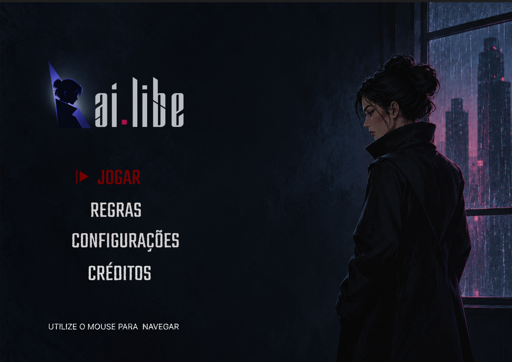

## Storyboard

1. O jogador abre o jogo.
2. O menu principal é apresentado.
3. O jogador seleciona "Iniciar Investigação".
4. O contexto do caso é exibido.
5. O primeiro interrogatório é iniciado.

## Diagrama de Atividades

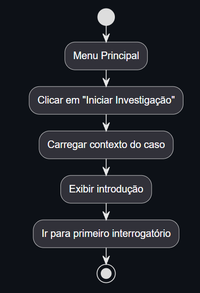

---

# US02 - Consultar Tutorial

## História de Usuário

Como jogador,
quero acessar o tutorial,
para entender as mecânicas do jogo.

## Sketch

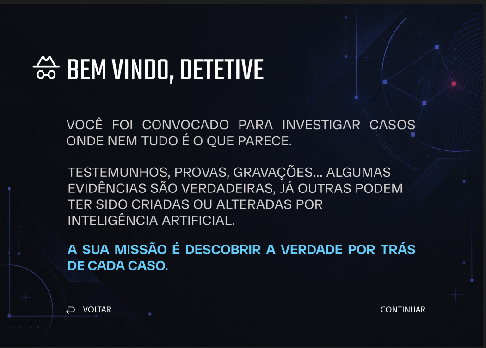

## Storyboard

1. O jogador acessa o menu principal.
2. Seleciona a opção Tutorial.
3. O sistema apresenta as regras.
4. O jogador aprende as mecânicas.
5. Retorna ao menu principal.

## Diagrama de Atividades

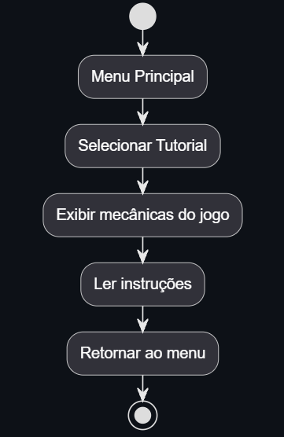

---

# US03 - Configurações

## História de Usuário

Como jogador,
quero alterar as configurações,
para personalizar minha experiência.

## Sketch

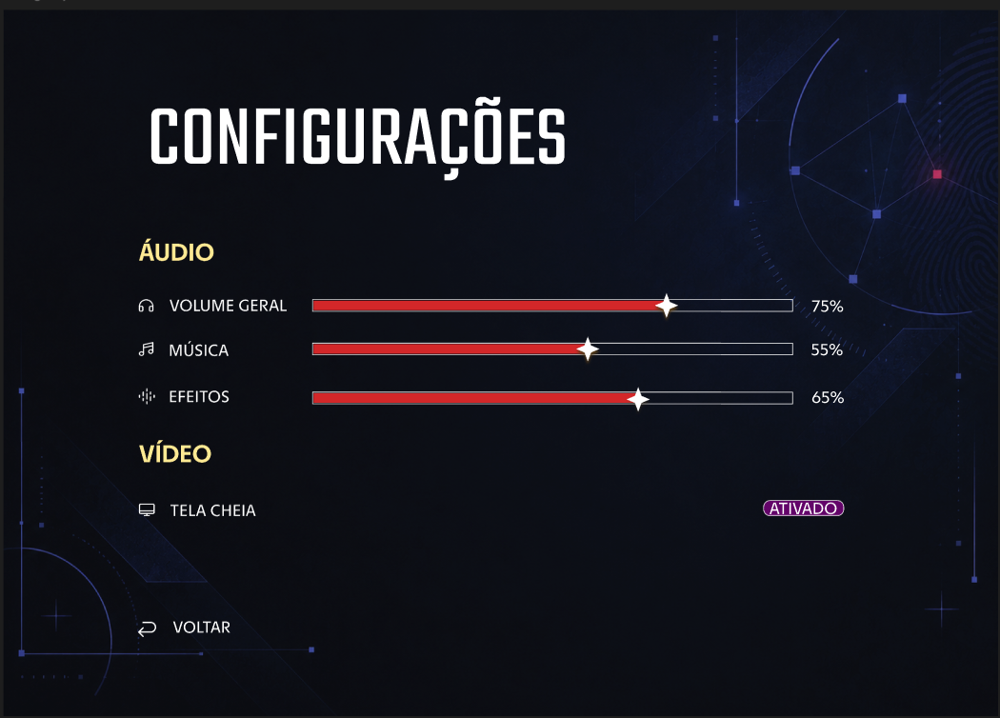

## Storyboard

1. O jogador acessa configurações.
2. Ajusta as opções desejadas.
3. Salva as alterações.
4. O sistema registra as mudanças.
5. Retorna ao menu principal.

## Diagrama de Atividades

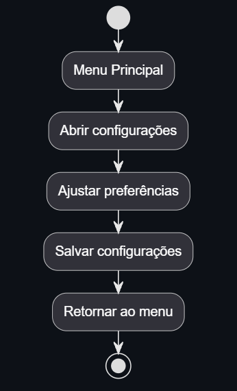

---

# US04 - Conhecer o Contexto do Caso

## História de Usuário

Como investigador,
quero conhecer os detalhes do caso,
para iniciar a investigação.

## Sketch

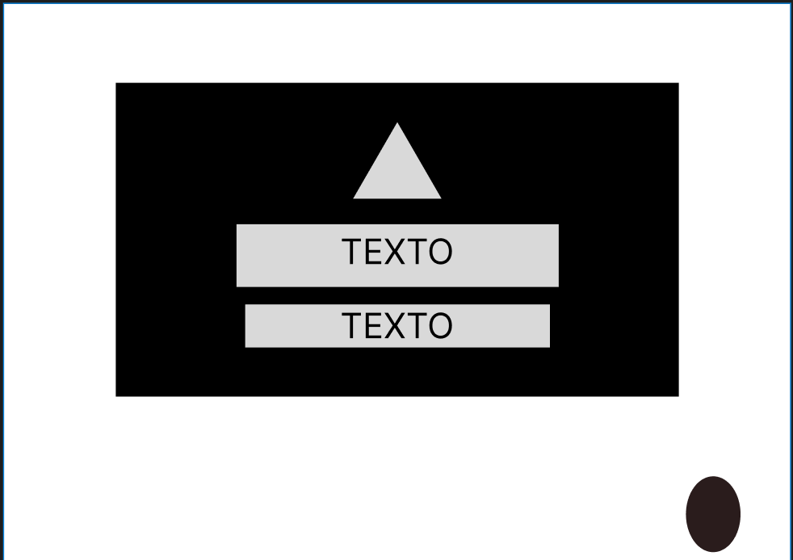

## Storyboard

1. A narrativa inicial é apresentada.
2. O crime é descrito.
3. Os suspeitos são apresentados.
4. O objetivo da investigação é explicado.
5. O jogador segue para o interrogatório.

## Diagrama de Atividades

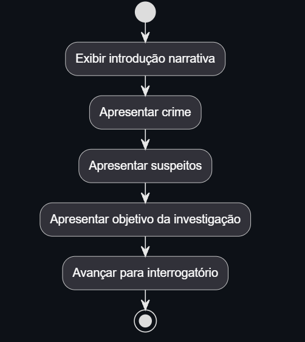

---

# US05 - Interrogar Suspeito

## História de Usuário

Como investigador,
quero interrogar suspeitos,
para obter informações sobre o caso.

## Sketch

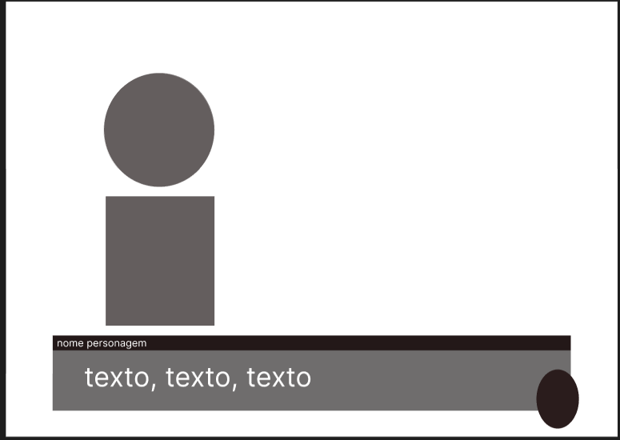

## Storyboard

1. O jogador encontra um suspeito.
2. O suspeito fornece seu depoimento.
3. O jogador acompanha o diálogo.
4. Novas pistas surgem.
5. O desafio lógico é iniciado.

## Diagrama de Atividades

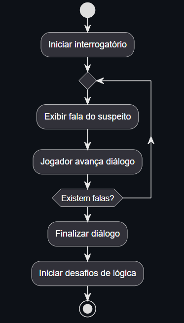

---

# US06 - Resolver Pergunta de Lógica

## História de Usuário

Como investigador,
quero resolver desafios de lógica,
para desbloquear evidências.

## Sketch

## Storyboard

1. Uma pergunta lógica é apresentada.
2. O jogador analisa as alternativas.
3. Seleciona uma resposta.
4. O sistema valida a resposta.
5. O resultado é exibido.

## Diagrama de Atividades

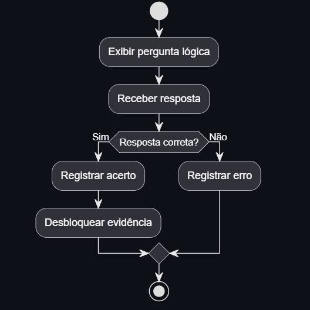

---

# US07 - Desbloquear Evidência

## História de Usuário

Como investigador,
quero desbloquear evidências,
para avançar na investigação.

## Sketch

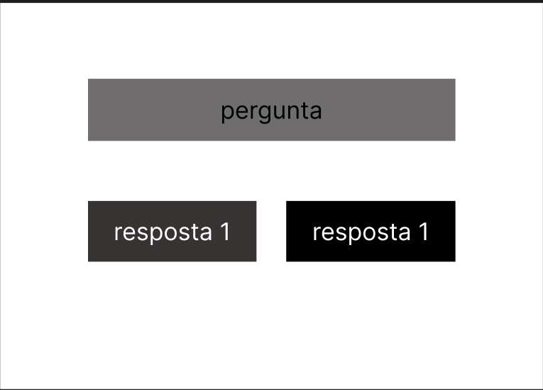

## Storyboard

1. O jogador responde corretamente.
2. A evidência é liberada.
3. A evidência é adicionada ao dossiê.
4. O jogador a visualiza.
5. A análise é iniciada.

## Diagrama de Atividades

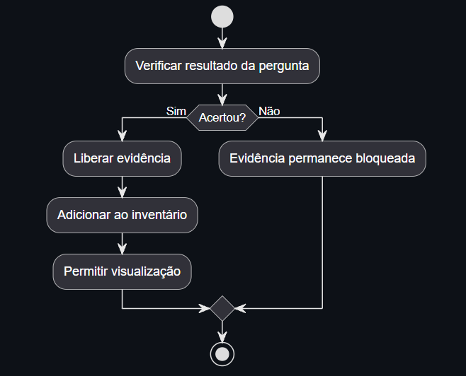

---

# US08 - Identificar Evidência Gerada por IA

## História de Usuário

Como investigador,
quero analisar evidências,
para identificar adulterações por IA.

## Sketch

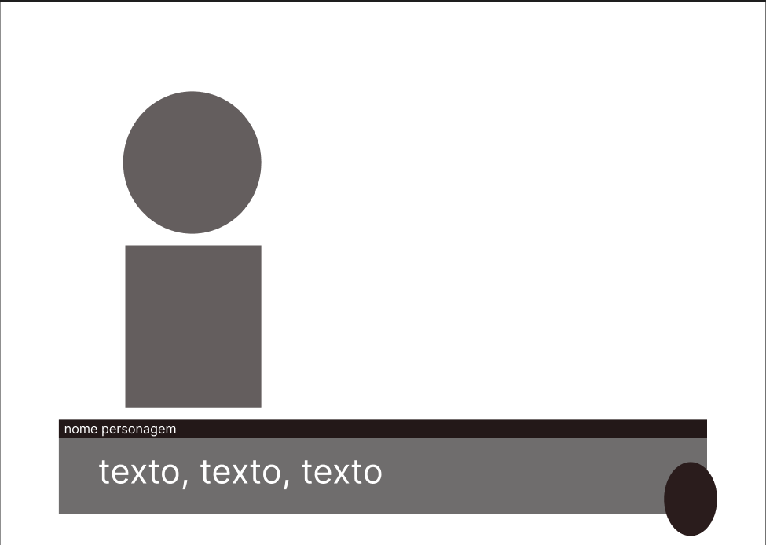

## Storyboard

1. O jogador visualiza a evidência.
2. Analisa o conteúdo.
3. Procura sinais de adulteração.
4. Marca IA ou Autêntica.
5. O sistema registra a resposta.

## Diagrama de Atividades

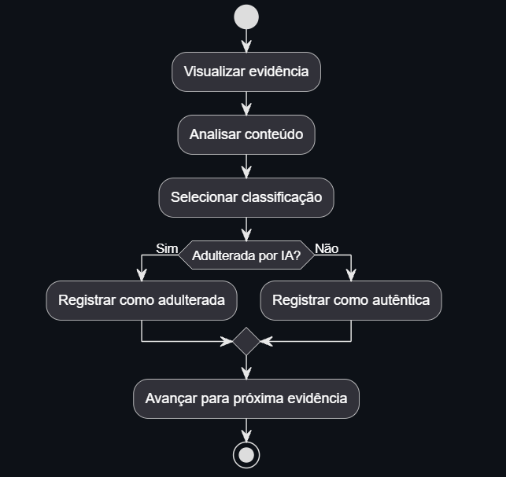

---

# US09 - Consultar Dossiê

## História de Usuário

Como investigador,
quero acessar o dossiê da investigação,
para revisar as evidências obtidas.

## Sketch

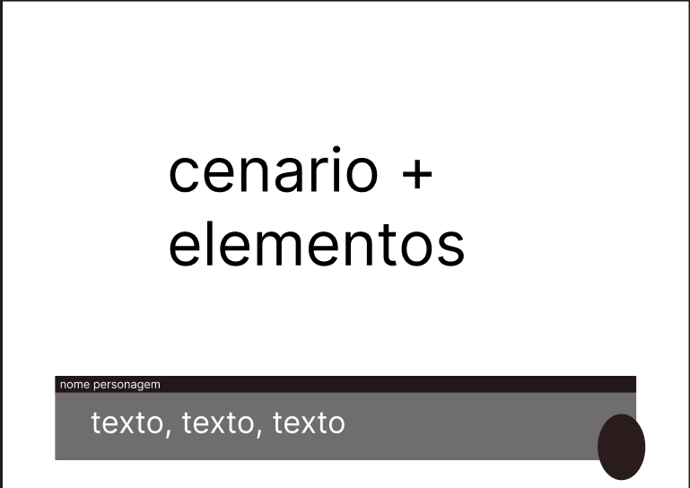

## Storyboard

1. O jogador abre o dossiê.
2. A lista de evidências é exibida.
3. Uma evidência é selecionada.
4. Os detalhes são analisados.
5. O jogador retorna à investigação.

## Diagrama de Atividades

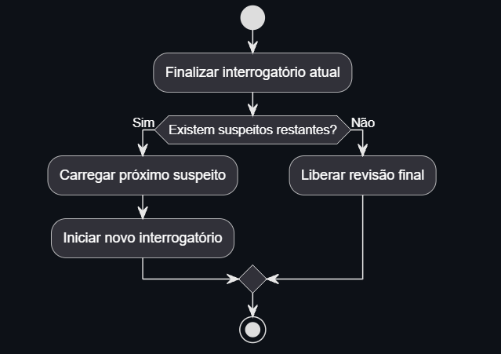

---

# US10 - Avançar Entre Interrogatórios

## História de Usuário

Como investigador,
quero avançar para novos interrogatórios,
para continuar a investigação.

## Sketch

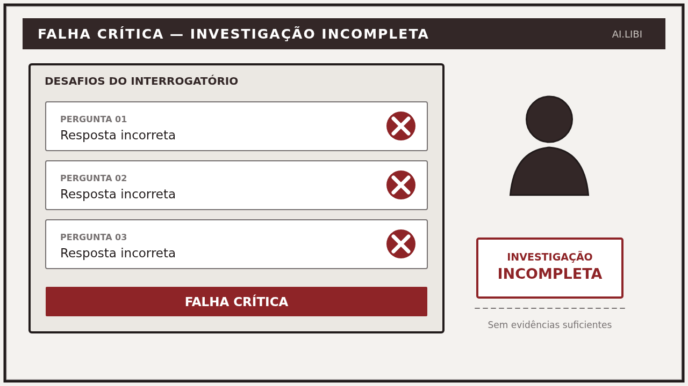

## Storyboard

1. O interrogatório atual termina.
2. O sistema apresenta o resumo do desempenho.
3. O jogador analisa as evidências obtidas.
4. Clica em "Próximo Interrogatório".
5. O próximo suspeito é carregado.

## Diagrama de Atividades

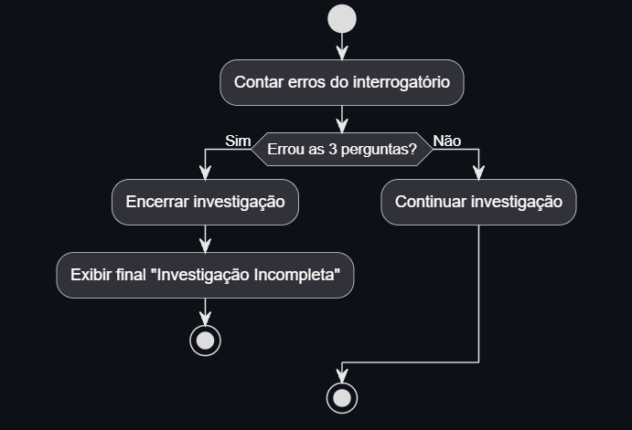

---

# US11 - Revisar Evidências

## História de Usuário

Como investigador,
quero revisar todas as evidências,
para tomar uma decisão correta.

## Sketch

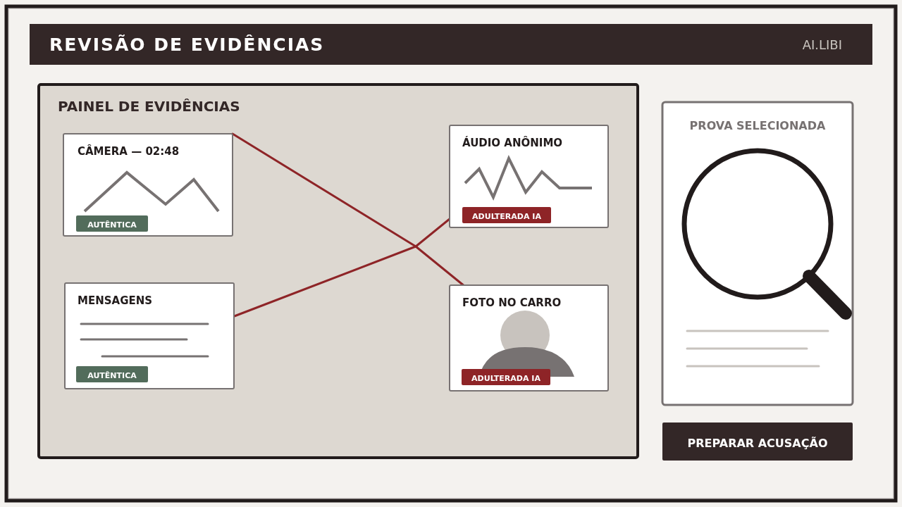

## Storyboard

1. Os interrogatórios terminam.
2. O painel de evidências é aberto.
3. O jogador revisa as provas.
4. Compara os resultados.
5. Prepara sua acusação.

## Diagrama de Atividades

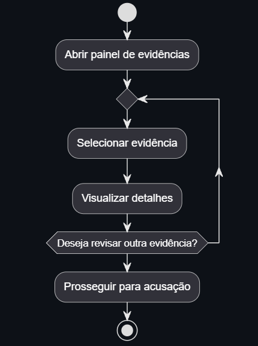

---

# US12 - Escolher Culpado

## História de Usuário

Como investigador,
quero escolher o culpado,
para encerrar a investigação.

## Sketch

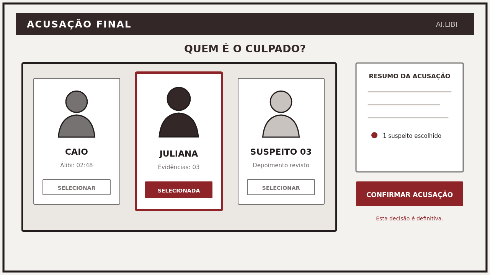

## Storyboard

1. A lista de suspeitos é apresentada.
2. O jogador revisa as informações.
3. Seleciona um suspeito.
4. Confirma a acusação.
5. O sistema processa a escolha.

## Diagrama de Atividades

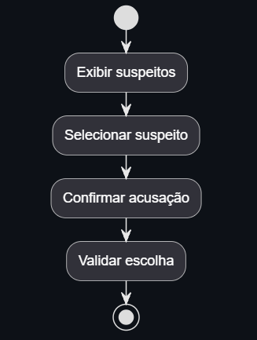
---

# US13 - Good Ending

## História de Usuário

Como jogador,
quero receber um final positivo,
quando solucionar corretamente o caso.

## Sketch

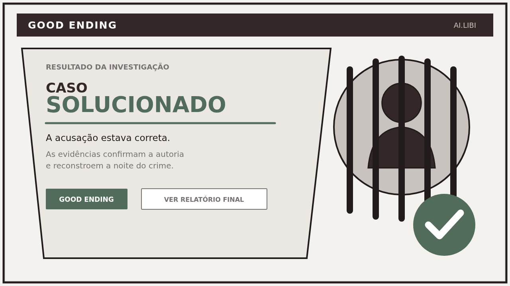

## Storyboard

1. A acusação é enviada.
2. O sistema verifica a resposta.
3. O culpado correto é identificado.
4. O caso é resolvido.
5. O relatório final é exibido.

## Diagrama de Atividades

---

# US14 - Bad Ending

## História de Usuário

Como jogador,
quero visualizar as consequências de um erro,
para compreender o resultado da investigação.

## Sketch

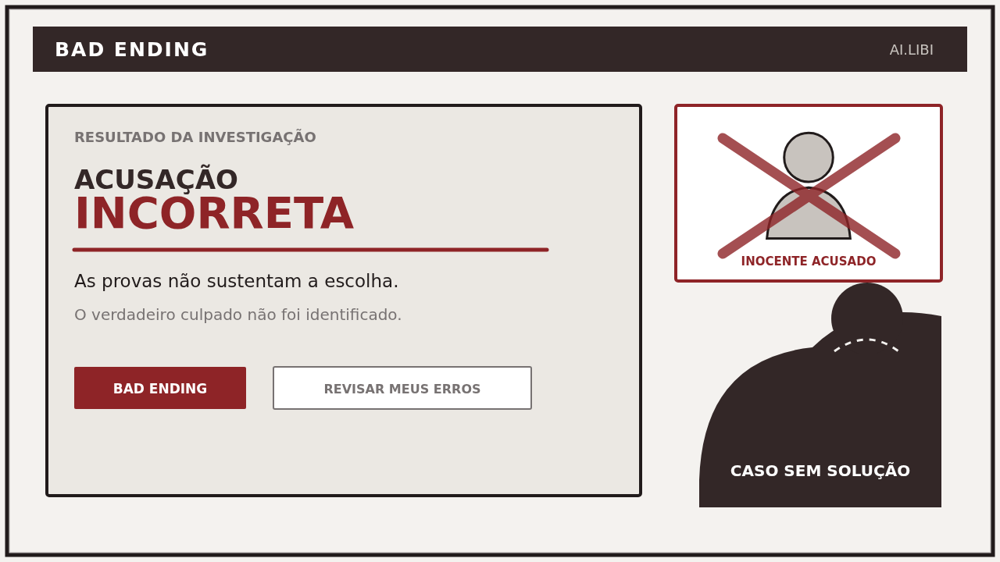

## Storyboard

1. A acusação é enviada.
2. O sistema verifica a resposta.
3. Um inocente é acusado.
4. O caso permanece sem solução.
5. O relatório final é apresentado.

## Diagrama de Atividades

---

# US15 - Relatório Final

## História de Usuário

Como jogador,
quero visualizar o relatório final,
para compreender toda a investigação.

## Sketch

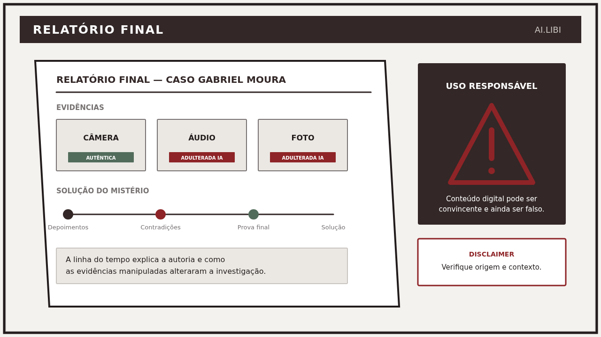

## Storyboard

1. A tela final é aberta.
2. Todas as evidências são exibidas.
3. As adulterações por IA são destacadas.
4. A solução é explicada.
5. Um alerta sobre o uso indevido da IA é apresentado.

## Diagrama de Atividades

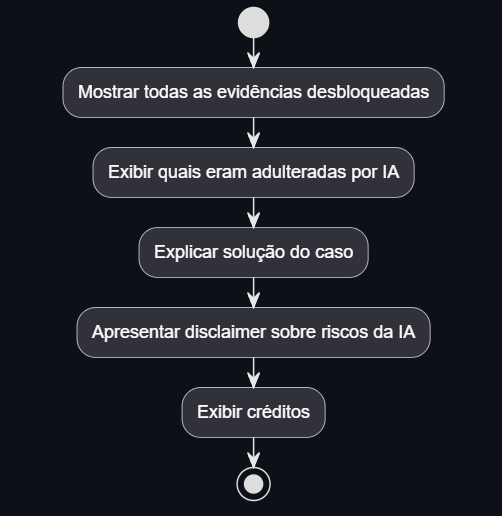

##🎮 Protótipo Navegável

[Protótipo no Figma](https://www.figma.com/proto/nYrh1RndZJO9kXkZlXdNWN/ai.libe?node-id=8-10&t=DVWzvsOVZvj6wX6e-0&scaling=min-zoom&content-scaling=fixed&page-id=0%3A1
)

[Acesse o vídeo de navegação pelo protótipo no Google Drive](https://drive.google.com/file/d/1p1ygVFuu-OtDfhTMRVN4-6xVGGTo9_HO/view?usp=sharing)

## 👥 Equipe

Product Owner

- Giovana Monteiro
  * 👔 **LinkedIn:** [Acesse o perfil de Giovana Monteiro](www.linkedin.com/in/giovana-monteiro-a419a4349)

👨‍💻 Programadores

- Luma Frazão
  * 👔 **LinkedIn:** [Acesse o perfil de Luma Frazão](https://www.linkedin.com/in/luma-frazão-5b91a239b)
  
- Lanna Marcullino
  * 👔 **LinkedIn:** [Acesse o perfil de Lanna Marcullino](https://www.linkedin.com/in/lanna-marculino-988aa03b2)

- Letícia Minucelli
  * 👔 **LinkedIn:** [Acesse o perfil de Letícia Minucelli](https://www.linkedin.com/in/letícia-minucelli-46106430b)

🎮 Game Designers

- Victor Pina
  * 👔 **LinkedIn:** [Acesse o perfil de Victor Pina](https://www.linkedin.com/in/victor-s-pina-b78777303)

- Raysha Neide
  * 👔 **LinkedIn:** [Acesse o perfil de Raysha Neide](https://www.linkedin.com/in/rayshaneide?utm_source=share_via&utm_content=profile&utm_medium=member_ios)

✍️ Roteiristas

- Raysha Neide
  * 👔 **LinkedIn:** [Acesse o perfil de Raysha Neide](https://www.linkedin.com/in/rayshaneide?utm_source=share_via&utm_content=profile&utm_medium=member_ios)

- Letícia Minucelli
  * 👔 **LinkedIn:** [Acesse o perfil de Letícia Minucelli](https://www.linkedin.com/in/letícia-minucelli-46106430b)

🔬 Research / UX

- Júlia Aquino
  * 👔 **LinkedIn:** [Acesse o perfil de Júlia Aquino](https://www.linkedin.com/in/júlia-aquino-0764273b3)

- Victor Pina
  * 👔 **LinkedIn:** [Acesse o perfil de Victor Pina](https://www.linkedin.com/in/victor-s-pina-b78777303)

- Vitória Thayná
  * 👔 **LinkedIn:** [Acesse o perfil de Vitória Thayná](https://www.linkedin.com/in/vitoriatayna)

🎨 Visual Designers

- Luma Frazão
  * 👔 **LinkedIn:** [Acesse o perfil de Luma Frazão](https://www.linkedin.com/in/luma-frazão-5b91a239b)

- Raysha Neide
  * 👔 **LinkedIn:** [Acesse o perfil de Raysha Neide](https://www.linkedin.com/in/rayshaneide?utm_source=share_via&utm_content=profile&utm_medium=member_ios)

---

## 📋 Backlog

O backlog contém as funcionalidades, tarefas e atividades planejadas para o desenvolvimento do IA.libi.

---

🗂️ Estrutura do Projeto

A organização atual do projeto segue a estrutura abaixo:

IA.libi/
│
├── src/
│   └── backlog.png
│
├── README.md
│
└── ...

«A estrutura será atualizada conforme novas funcionalidades e componentes forem adicionados ao projeto.»

---

🚀 Desenvolvimento

O desenvolvimento do IA.libi é realizado de forma colaborativa, envolvendo diferentes áreas:

Produto → Design → Roteiro → UX/Research → Programação → Testes

Cada área contribui para transformar a proposta educacional em uma experiência investigativa interativa.

---

🛠️ Tecnologias

«Em desenvolvimento»

As tecnologias utilizadas no projeto serão documentadas nesta seção conforme forem definidas e incorporadas ao desenvolvimento.

---

📈 Status do Projeto

🟡 Em desenvolvimento

O projeto encontra-se em fase de desenvolvimento e planejamento de suas mecânicas, narrativa, experiência do usuário e implementação.

---

🎓 Contexto Acadêmico

O IA.libi foi desenvolvido como um projeto acadêmico com foco na aplicação prática de conceitos de lógica proposicional, Inteligência Artificial, investigação e pensamento crítico por meio do desenvolvimento de um jogo digital.

---

💭 Motivação

Com a popularização de ferramentas capazes de gerar imagens, textos, vídeos, áudios e outros conteúdos, tornou-se cada vez mais importante desenvolver a capacidade de avaliar criticamente as informações recebidas.

O IA.libi transforma esse problema em uma experiência de investigação:

«Questione. Investigue. Analise. Conclua.»

Porque, em uma investigação — assim como na vida real — uma informação convincente não é necessariamente uma informação verdadeira.

---

📄 Licença

Este projeto possui finalidade acadêmica e educacional.Essa versão já fica bem mais próxima de um README de projeto profissional: tem hierarquia clara, onboarding, documentação das mecânicas, contexto, equipe, status e estrutura, além de usar o backlog como parte da documentação.
